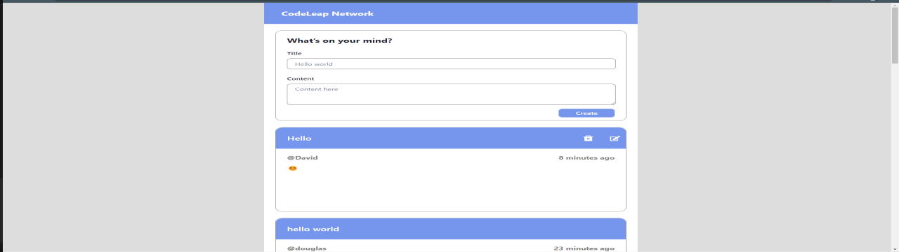
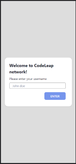
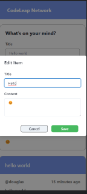
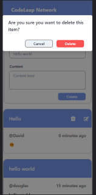

# CodeLead Engineenring Test

## Junior Frontend Engineer

### Hello, I'm David Alves Costa.

#### This is my project, I hope it contains all the requested requirements. thank you for being able to participate in this selection process

Deploy : https:/

### To start the project inicio , fork it and start it in the correct folder

```
npm install
npm run dev
```

<a id="ancora"></a>

# <b> Menu </b>

- [The Project](#project)
- [Project folders](#pages)
- [Technologies used](#techused)


<a id="project"></a>

# The Project

## This project consists of making a CRUD application.

### Desktop



#

### Responsive






#

<a id="techused"></a>

## Technologies used

#

- React ;
- Hooks
- Chakra UI;
- Axios
- React-router-dom;
- Redux ;
- Redux-logger;
- Redux-thunk;
- React-icons

#

[Topo](#ancora)

<a id="Pages"></a>

## Project folders

#

### Pages

- SignUp.js;
- HomePage.js;

### Components

- CardPosted;
- CardToCreate;
- Header;
- ModalToDelete;
- ModalToEdit;

### redux

- store;
- actions;
- actionType;
- reducer;
- root-reducer;

### router

- coordinator;
- Router

#

<a id="techused"></a>

# functionalities

- Start with name on SignUp page
- See all posts;
- Create a post;
- Edit just the created post;
- Delete only created post;
